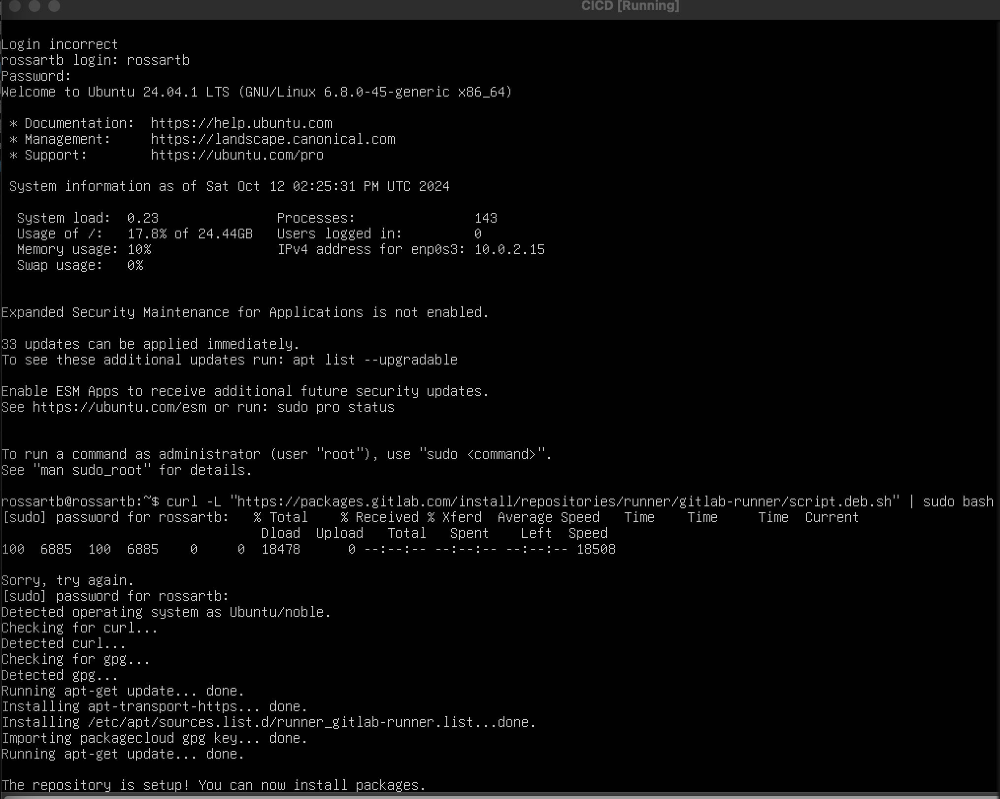

##Часть 1. Настройка gitlab-runner

Запустите виртуальную машину Ubuntu Server 20.04 LTS

Загрузите gitlab-runner на виртуальную машину

Установите gitlab-runner на виртуальную машину

После установки gitlab-runner разрешаем автозапуск сервиса и стартуем его

Для регистрации понадобятся URL и токен, которые можно получить на страничке задания на платформе

Зарегистрируйте его для использования в текущем проекте ( DO6_CICD )

##Part 2. Сборка

Написать этап для CI по сборке приложений из проекта C2_SimpleBashUtils:

В файле gitlab-ci.yml добавить этап запуска сборки через мейк файл из проекта C2

Файлы, полученные после сборки (артефакты), сохранять в произвольную директорию со сроком хранения 30 дней

Устанавливает мета-пакет build-essential, который включает в себя основные инструменты для разработки и
утилиту make, которая помогает автоматизировать процесс сборки программ

Результат

##Part 3. Тест кодстайла

Написать этап для CI, который запускает скрипт кодстайла (clang-format):

Установка clang-format на Ubuntu

Если кодстайл не прошел, то "зафейлить" пайплайн

В пайплайне отобразить вывод утилиты clang-format
Результат

##Part 4. Интеграционные тесты

Написать этап для CI, который запускает ваши интеграционные тесты из того же проекта:

Запускать этот этап автоматически только при условии, если сборка и тест кодстайла прошли успешно

Если тесты не прошли, то "зафейлить" пайплайн и в пайплайне отобразить вывод, что интеграционные тесты 
успешно прошли / провалились
Результат отрицательный

Результат положительный

##Part 5. Этап деплоя

Поднять вторую виртуальную машину Ubuntu Server 20.04 LTS

Написать этап для CD, который "разворачивает" проект на другой виртуальной машине:

Запускать этот этап вручную при условии, что все предыдущие этапы прошли успешно и
В случае ошибки "зафейлить" пайплайн
В файле gitlab-ci.yml добавить этап запуска написанного скрипта

Написать bash-скрипт, который при помощи ssh и scp копирует файлы, полученные после сборки (артефакты), в директорию /usr/local/bin второй виртуальной машины

В результате вы должны получить готовые к работе приложения из проекта C2_SimpleBashUtils (s21_cat и s21_grep) на второй виртуальной машине.

Сохранить дампы образов виртуальных машин
p.s. Ни в коем случае не сохранять дампы в гит!

Сохранила :) через Export to OCI...

##Part 6. Дополнительно. Уведомления

Настроить уведомления о успешном/неуспешном выполнении пайплайна через бота с именем "[ваш nickname] DO6 CI/CD" в Telegram

Текст уведомления должен содержать информацию об успешности прохождения как этапа CI, так и этапа CD.
В остальном текст уведомления может быть произвольным.

